import MermaidZoomWrapper from '@site/src/components/MermaidZoomWrapper';

> Monitoring performance and user experience is crucial for maintaining high-quality API service. This section covers key metrics, benchmarks, and optimization guidelines.

---

## 🎯 Time-to-First-Success (TTFS)

### Definition

Time-to-First-Success measures how quickly a new user can complete their first successful API call and get meaningful results.

### Current Benchmarks

| User Type                 | Target TTFS  | Current Average | 95th Percentile |
|---------------------------|--------------|-----------------|-----------------|
| **Experienced Developer** | < 5 minutes  | 3.2 minutes     | 7 minutes       |
| **New to Medical APIs**   | < 15 minutes | 12.1 minutes    | 22 minutes      |
| **Clinical Integration**  | < 30 minutes | 28.5 minutes    | 45 minutes      |

### TTFS Breakdown

```mermaid
gantt
    title Time-to-First-Success Journey
    dateFormat  X
    axisFormat %s
    
    section Account Setup
    Create Account       :0, 120
    Generate API Key     :60, 180
    
    section First Call
    Read Quickstart      :180, 480
    Write First Request  :300, 600
    Debug Issues         :420, 720
    
    section Success
    Get Valid Response   :600, 720
    Understand Results   :660, 780
```

<div className="mermaid-container">

<MermaidZoomWrapper>



</MermaidZoomWrapper>

</div>

### Optimization Strategies

- **Pre-populated examples**: Ready-to-run code snippets
- **Interactive tutorials**: Step-by-step guided experience
- **Error prevention**: Input validation and clear error messages
- **Progressive disclosure**: Start simple, add complexity gradually

---

## ⚡ API Performance Metrics

### Response Time Benchmarks

#### By Endpoint Category

| Endpoint Type         | Target  | P50   | P95   | P99   |
|-----------------------|---------|-------|-------|-------|
| **Authentication**    | < 200ms | 85ms  | 180ms | 350ms |
| **Image Upload**      | < 2s    | 1.2s  | 2.8s  | 4.1s  |
| **AI Analysis**       | < 15s   | 8.3s  | 14.2s | 22.1s |
| **Report Generation** | < 5s    | 2.1s  | 4.8s  | 7.2s  |
| **Metadata Queries**  | < 500ms | 120ms | 420ms | 680ms |

#### By Image Complexity

```yaml
performance_by_complexity:
  simple_xray:
    target: "< 8s"
    average: "4.2s"
    
  standard_ct:
    target: "< 15s" 
    average: "8.7s"
    
  complex_mri:
    target: "< 25s"
    average: "18.3s"
    
  multi_series:
    target: "< 45s"
    average: "34.1s"
```

### Throughput Metrics

- **Peak requests/second**: 2,400 RPS
- **Sustained throughput**: 1,800 RPS
- **Concurrent image processing**: 150 images
- **Queue depth (normal)**: < 5 requests
- **Queue depth (peak)**: < 25 requests

---

## 📈 Usage Analytics

### API Adoption Metrics

#### Monthly Active Users (MAU)

```yaml
user_growth:
  january_2025: 1247
  february_2025: 1456
  march_2025: 1789
  april_2025: 2134
  may_2025: 2598
  growth_rate: "+18% MoM average"
```

#### Usage Patterns

| Metric                 | Value  | Trend     |
|------------------------|--------|---------- |
| **Daily API calls**    | 45,600 | ↗️ +12%  |
| **Average calls/user** | 28.3   | ↗️ +8%   |
| **Success rate**       | 97.8%  | ↗️ +0.3% |
| **Error rate**         | 2.2%   | ↘️ -0.3% |

### Feature Adoption

```yaml
endpoint_usage:
  image_analysis: 68%
  report_generation: 23%
  batch_processing: 12%
  metadata_extraction: 8%
  
ai_features:
  detection: 89%
  classification: 76%
  measurement: 45%
  uncertainty_estimation: 23%
```

### Geographic Distribution

| Region            | Usage % | Avg Response Time |
|-------------------|---------|-------------------|
| **North America** | 45%     | 180ms             |
| **Europe**        | 32%     | 220ms             |
| **Asia-Pacific**  | 18%     | 280ms             |
| **Other**         | 5%      | 340ms             |

---

## 🚀 Performance Optimization

### Client-Side Optimization

#### Image Preprocessing

```javascript
// Optimize images before upload
const optimizeImage = async (imageFile) => {
  const canvas = document.createElement('canvas');
  const ctx = canvas.getContext('2d');
  
  // Resize if too large
  const maxDimension = 2048;
  if (imageFile.width > maxDimension || imageFile.height > maxDimension) {
    const ratio = Math.min(maxDimension / imageFile.width, maxDimension / imageFile.height);
    canvas.width = imageFile.width * ratio;
    canvas.height = imageFile.height * ratio;
  }
  
  // Compress quality for non-DICOM images
  return canvas.toBlob(null, 'image/webp', 0.85);
};
```

#### Request Batching

```python
# Batch multiple images for better throughput
async def batch_analyze_images(images, batch_size=4):
    results = []
    for i in range(0, len(images), batch_size):
        batch = images[i:i + batch_size]
        batch_results = await asyncio.gather(*[
            analyze_image(img) for img in batch
        ])
        results.extend(batch_results)
    return results
```

### Server-Side Optimizations

#### Response Compression

```yaml
compression_settings:
  gzip_enabled: true
  compression_level: 6
  min_response_size: 1KB
  content_types:
    - "application/json"
    - "text/html"
    - "application/xml"
```

#### Caching Strategy

```yaml
caching_layers:
  cdn_cache:
    static_assets: "1 year"
    api_responses: "5 minutes"
    
  application_cache:
    model_weights: "persistent"
    processed_images: "1 hour"
    user_sessions: "24 hours"
    
  database_cache:
    frequent_queries: "15 minutes"
    metadata: "1 hour"
```

---

## 📱 Mobile & Responsive Performance

### Mobile Optimization Metrics

| Device Category      | Target Load Time | Current Average |
|----------------------|------------------|-----------------|
| **High-end Mobile**  | < 3s             | 2.1s            |
| **Mid-range Mobile** | < 5s             | 3.8s            |
| **Low-end Mobile**   | < 8s             | 6.2s            |
| **Tablet**           | < 2s             | 1.7s            |

### Responsive Design Benchmarks

```yaml
viewport_performance:
  mobile_portrait: "< 320px width"
  mobile_landscape: "568px - 768px"
  tablet: "768px - 1024px"
  desktop: "> 1024px"
  
touch_targets:
  minimum_size: "44px x 44px"
  recommended_size: "48px x 48px"
  spacing: "8px minimum"
```

### Progressive Web App Features

- **Offline functionality**: Cache critical API responses
- **Push notifications**: Analysis completion alerts
- **App-like experience**: Full-screen mode, home screen install
- **Background sync**: Queue requests when offline

---

## 🔍 Search Performance

### Search Functionality Metrics

| Search Type              | Target Response | Current Average |
|--------------------------|-----------------|-----------------|
| **Documentation Search** | < 100ms         | 45ms            |
| **API Endpoint Search**  | < 150ms         | 67ms            |
| **Code Example Search**  | < 200ms         | 123ms           |
| **Full-text Search**     | < 300ms         | 198ms           |

### Search Quality Metrics

```yaml
search_quality:
  precision_at_10: 0.89
  recall_at_10: 0.76
  click_through_rate: 0.67
  zero_results_rate: 0.08
```

### Search Implementation

```javascript
// Implement fuzzy search with performance optimization
const searchAPI = {
  index: null,
  
  async initialize() {
    // Load search index
    this.index = await import('./search-index.json');
  },
  
  search(query, options = {}) {
    const startTime = performance.now();
    
    const results = this.fuzzySearch(query, {
      threshold: 0.3,
      maxResults: options.limit || 10,
      fields: ['title', 'content', 'tags']
    });
    
    const duration = performance.now() - startTime;
    this.trackSearchMetrics(query, results.length, duration);
    
    return results;
  }
};
```

---

## 📊 Monitoring & Alerting

### Key Performance Indicators (KPIs)

```yaml
kpi_thresholds:
  availability:
    target: "99.9%"
    warning: "< 99.5%"
    critical: "< 99.0%"
    
  response_time:
    target: "< 10s avg"
    warning: "> 15s avg"
    critical: "> 30s avg"
    
  error_rate:
    target: "< 1%"
    warning: "> 2%"
    critical: "> 5%"
    
  user_satisfaction:
    target: "> 4.5/5"
    warning: "< 4.0/5"
    critical: "< 3.5/5"
```

### Real-time Monitoring

```yaml
monitoring_tools:
  apm: "New Relic / DataDog"
  uptime: "Pingdom / StatusPage"
  rum: "Google Analytics / Mixpanel"
  logs: "ELK Stack / Splunk"
  
alerts:
  channels:
    - slack: "#api-alerts"
    - email: "oncall@neolens.ai"
    - pagerduty: "escalation_policy_1"
  
  conditions:
    - error_rate > 5% for 5 minutes
    - response_time > 30s for 3 minutes
    - availability < 99% for 1 minute
```

---

## 📈 Performance Improvement Roadmap

### Q3 2025 Goals

- Reduce TTFS by 25% for new users
- Achieve < 5s average response time for all endpoints
- Implement advanced caching (Redis cluster)
- Launch mobile-optimized documentation
- Add real-time performance dashboard

### Q4 2025 Goals

- Edge computing deployment (reduce latency by 40%)
- Advanced image preprocessing pipeline
- Predictive scaling based on usage patterns
- GraphQL API for optimized queries
- Performance budget monitoring

---

## 💡 User Experience Improvements

### Recent UX Enhancements

```yaml
recent_improvements:
  - feature: "Interactive code examples"
    impact: "+23% TTFS improvement"
    release: "v1.2.0"
    
  - feature: "Auto-retry with exponential backoff"
    impact: "-45% timeout errors"
    release: "v1.1.8"
    
  - feature: "Progress indicators for long operations"
    impact: "+18% user satisfaction"
    release: "v1.1.5"
```

### User Feedback Integration

- **NPS Score**: 8.3/10 (Industry leading)
- **Support ticket reduction**: -32% since documentation improvements
- **Feature request fulfillment**: 78% within 2 quarters
- **User onboarding completion**: 89% (vs 67% industry average)

---

:::tip[Performance Best Practices]

- **Monitor continuously**: Use APM tools to track real-world performance
- **Optimize for 95th percentile**: Focus on worst-case scenarios
- **Test with real data**: Use production-like datasets for benchmarking
- **Consider user context**: Medical professionals need reliability over speed
- **Plan for growth**: Design for 10x current usage

:::

---

