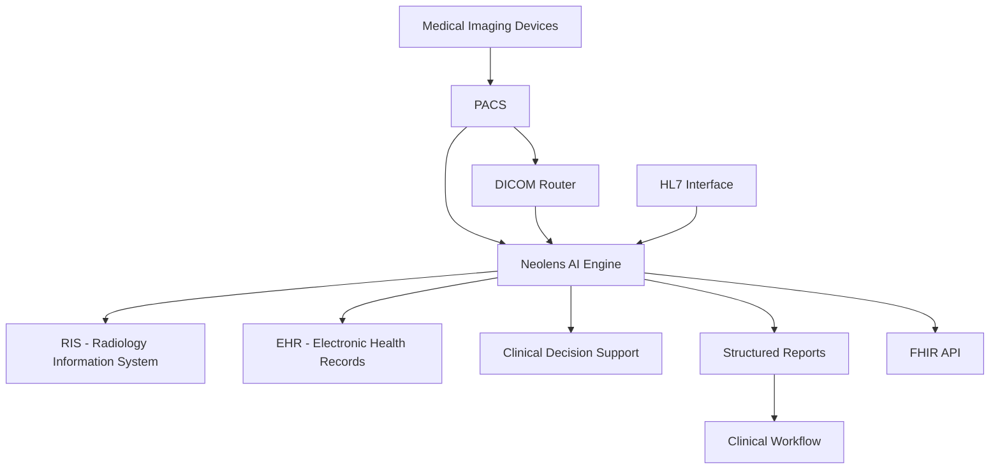

## 🏥 Hospital Systems Integration

> Seamlessly integrate Neolens AI into your existing healthcare IT infrastructure with support for PACS, RIS, EHR, and other critical hospital systems.

---

## 🏗️ Integration Architecture Overview

### Core Integration Points



---

## 📡 PACS Integration

### DICOM Connectivity

Neolens supports standard DICOM protocols for seamless PACS integration:

**Supported DICOM Services:**

- **C-STORE**: Receive images from PACS
- **C-FIND**: Query PACS for studies
- **C-MOVE**: Retrieve specific studies
- **C-ECHO**: Verify connectivity
- **DICOM SR**: Send structured reports back

### PACS Integration Methods

#### Method 1: DICOM Route-Based Integration

```yaml
# DICOM Router Configuration
dicom_router:
  ae_title: "NEOLENS_AI"
  port: 4242
  routes:
    - source: "PACS_SERVER"
      destination: "https://api.neolens.ai/v1/dicom"
      conditions:
        - modality: ["CT", "MR", "CR", "DX"]
        - study_description: ["CHEST", "ABDOMEN", "BRAIN"]
```

#### Method 2: PACS Vendor API Integration

```javascript
// Example: Sectra PACS Integration
const sectraAPI = {
  endpoint: "https://pacs.hospital.com/api/v1",
  authentication: "Bearer TOKEN",
  webhooks: {
    new_study: "https://api.neolens.ai/v1/webhooks/sectra/new-study",
    study_complete: "https://api.neolens.ai/v1/webhooks/sectra/complete"
  }
};
```

#### Method 3: Worklist-Based Integration

```json
{
  "worklist_integration": {
    "polling_interval": "30s",
    "filters": {
      "modalities": ["CT", "MR", "DX"],
      "priorities": ["HIGH", "URGENT"],
      "age_range": "> 18 years"
    },
    "auto_processing": true,
    "result_routing": "back_to_pacs"
  }
}
```

---

## 🗂️ RIS Integration

### Radiology Information System Connectivity

#### HL7 Message Integration

```yaml
# HL7 Configuration
hl7_integration:
  version: "2.5.1"
  encoding: "UTF-8"
  message_types:
    - "ORM^O01": # Order Message
        trigger: "new_radiology_order"
        action: "queue_for_ai_analysis"
    - "ORU^R01": # Result Message  
        trigger: "ai_analysis_complete"
        action: "send_structured_report"
```

#### Sample HL7 ORU Message (AI Results)

```hl7
MSH|^~\&|NEOLENS|AI_ENGINE|RIS|HOSPITAL|20250805143022||ORU^R01|12345|P|2.5.1
PID|1||123456789^^^HOSPITAL^MR||DOE^JOHN^||19850315|M|||123 Main St^^City^ST^12345
OBR|1||AI_20250805_001|CT^Computed Tomography|20250805143022||||||||||||20250805143522|||F
OBX|1|ST|AI_FINDING^AI Finding|1|Pulmonary nodule detected|||||F
OBX|2|NM|CONFIDENCE^Confidence Score|2|0.87|||||F  
OBX|3|ST|LOCATION^Anatomical Location|3|Right upper lobe|||||F
OBX|4|ST|RECOMMENDATION^Clinical Recommendation|4|Consider follow-up CT in 3 months|||||F
```

### RIS Workflow Integration

- **Auto-routing**: Priority cases flagged by AI
- **Worklist management**: AI results integrated into reading queues
- **Report templates**: Pre-populated findings from AI analysis
- **Quality metrics**: Track AI performance in clinical workflow

---

## 📋 EHR Integration

### Electronic Health Record Connectivity

#### FHIR R4 API Integration

```json
{
  "resourceType": "DiagnosticReport",
  "id": "neolens-ai-report-001",
  "status": "final",
  "category": [
    {
      "coding": [
        {
          "system": "http://terminology.hl7.org/CodeSystem/v2-0074",
          "code": "RAD",
          "display": "Radiology"
        }
      ]
    }
  ],
  "code": {
    "coding": [
      {
        "system": "http://loinc.org",
        "code": "24627-2",
        "display": "Chest CT"
      }
    ]
  },
  "subject": {
    "reference": "Patient/123456"
  },
  "effectiveDateTime": "2025-08-05T14:30:22Z",
  "issued": "2025-08-05T14:35:22Z",
  "performer": [
    {
      "reference": "Organization/neolens-ai",
      "display": "Neolens AI Engine"
    }
  ],
  "result": [
    {
      "reference": "Observation/ai-finding-001"
    }
  ]
}
```

#### EHR Vendor Integrations

**Epic Integration:**

```yaml
epic_integration:
  smart_on_fhir: true
  app_id: "neolens-ai-assistant"
  scopes: ["patient/DiagnosticReport.read", "patient/Observation.write"]
  launch_context: "radiology_workflow"
```

**Cerner Integration:**

```yaml
cerner_integration:
  smart_apps: true
  webhook_endpoints:
    - event: "imaging_study_complete"
      url: "https://api.neolens.ai/v1/webhooks/cerner"
```

**Allscripts Integration:**

```yaml
allscripts_integration:
  unity_api: true
  ehr_agent: "neolens_connector"
  data_exchange: "hl7_fhir"
```

---

## 🔄 Workflow Automation

### Clinical Decision Support Integration

#### CDS Hooks Implementation

```json
{
  "hook": "order-select",
  "context": {
    "userId": "radiologist123",
    "patientId": "patient456", 
    "selections": ["imaging-order-ct-chest"]
  },
  "services": [
    {
      "hook": "order-select",
      "name": "Neolens AI Recommendation",
      "id": "neolens-cds-service",
      "prefetch": {
        "patient": "Patient/{{context.patientId}}",
        "priorStudies": "DiagnosticReport?patient={{context.patientId}}&category=radiology"
      }
    }
  ]
}
```

### Automated Workflows

#### Priority Case Routing

```python
# Automated Priority Routing Example
def route_ai_results(ai_response):
    if ai_response.urgency == "critical":
        # Immediate notification
        send_sms_alert(radiologist_on_call)
        create_urgent_worklist_item()
        
    elif ai_response.urgency == "urgent":
        # Add to priority queue
        add_to_priority_worklist()
        send_email_notification()
        
    else:
        # Standard workflow
        add_to_standard_worklist()
```

#### Report Generation Automation

```yaml
automated_reporting:
  triggers:
    - ai_analysis_complete
    - radiologist_review_requested
  
  templates:
    - type: "preliminary_report"
      ai_confidence_threshold: 0.8
      auto_send: false
      
    - type: "screening_summary"  
      ai_confidence_threshold: 0.6
      auto_send: true
      recipients: ["ordering_physician"]
```

---

## 🔐 Security and Compliance

### Healthcare Data Security

- **HIPAA Compliance**: Full PHI protection
- **SOC 2 Type II**: Security controls certification
- **End-to-end encryption**: TLS 1.3 in transit, AES-256 at rest
- **Access controls**: Role-based permissions (RBAC)
- **Audit logging**: Complete activity tracking

### Network Security

```yaml
network_security:
  vpn_required: true
  ip_whitelisting: true
  certificate_pinning: true
  firewall_rules:
    - source: "hospital_network"
      destination: "api.neolens.ai"
      port: 443
      protocol: "HTTPS"
```

### Data Governance

- **Data residency**: Regional data storage options
- **Retention policies**: Configurable data lifecycle
- **Right to deletion**: GDPR compliance
- **Data minimization**: Only necessary data processed

---

## 📊 Monitoring and Analytics

### Integration Health Monitoring

```json
{
  "monitoring_dashboard": {
    "integration_status": {
      "pacs_connection": "healthy",
      "ris_messaging": "healthy", 
      "ehr_sync": "warning",
      "api_response_time": "125ms avg"
    },
    "processing_metrics": {
      "studies_processed_today": 247,
      "average_processing_time": "8.3s",
      "error_rate": "0.2%",
      "queue_depth": 3
    }
  }
}
```

### Clinical Analytics

- **AI performance metrics**: Accuracy, sensitivity, specificity
- **Workflow efficiency**: Time to diagnosis, report turnaround
- **User adoption**: Usage patterns, feature utilization
- **Quality indicators**: Follow-up compliance, outcome tracking

---

## 🚀 Deployment Models

### Cloud-Based Deployment

```yaml
cloud_deployment:
  type: "SaaS"
  hosting: "AWS/Azure/GCP"
  compliance: ["HIPAA", "SOC2", "ISO27001"]
  scalability: "auto-scaling"
  availability: "99.9% SLA"
```

### On-Premises Deployment  

```yaml
on_premises:
  type: "Private cloud"
  infrastructure: "Customer managed"
  requirements:
    - cpu: "Intel Xeon/AMD EPYC"
    - memory: "64GB+ RAM"
    - storage: "1TB+ NVMe SSD"
    - gpu: "NVIDIA V100/A100 (optional)"
  operating_system: ["Ubuntu 20.04+", "RHEL 8+", "Windows Server 2019+"]
```

### Hybrid Deployment

```yaml
hybrid_deployment:
  edge_processing: "On-premises"
  ai_inference: "Cloud-based"
  data_storage: "Customer choice"
  benefits: ["Low latency", "Data sovereignty", "Scalable compute"]
```

---

## 🛠️ Implementation Guide

### Phase 1: Planning & Assessment (Weeks 1-2)

- **Infrastructure assessment**: Current systems inventory
- **Integration requirements**: Define touchpoints and data flows
- **Security review**: Compliance and risk assessment
- **Stakeholder alignment**: IT, clinical, and administrative buy-in

### Phase 2: Pilot Implementation (Weeks 3-6)

- **Test environment setup**: Sandbox integration
- **Single modality pilot**: Start with one imaging type
- **User training**: Key stakeholders and super-users
- **Workflow validation**: Test integrated processes

### Phase 3: Production Rollout (Weeks 7-12)

- **Phased deployment**: Gradual system-wide rollout  
- **Performance monitoring**: Track metrics and issues
- **User support**: Help desk and documentation
- **Optimization**: Fine-tune based on real-world usage

### Phase 4: Ongoing Operations (Continuous)

- **Regular maintenance**: System updates and patches
- **Performance optimization**: Continuous improvement based on usage analytics
- **Clinical validation**: Ongoing accuracy assessment and model updates
- **Compliance monitoring**: Regular audits and certification renewals

---

## 🔧 Technical Requirements

### Infrastructure Prerequisites

#### Minimum System Requirements

| Component | Requirement | Recommended |
|-----------|-------------|-------------|
| **CPU** | 8 cores, 2.4GHz | 16+ cores, 3.0GHz |
| **Memory** | 32GB RAM | 64GB+ RAM |
| **Storage** | 500GB SSD | 1TB+ NVMe SSD |
| **Network** | 100 Mbps | 1 Gbps dedicated |
| **GPU** | Optional | NVIDIA T4 or better |

#### Network Requirements

```yaml
network_specifications:
  bandwidth:
    minimum: "100 Mbps"
    recommended: "1 Gbps"
  latency:
    maximum: "50ms"
    preferred: "<20ms"
  ports:
    inbound: [443, 4242]  # HTTPS API, DICOM
    outbound: [443, 587]  # HTTPS, SMTP
```

### Software Dependencies

```yaml
software_stack:
  operating_system:
    - "Ubuntu 20.04 LTS+"
    - "RHEL 8+"
    - "Windows Server 2019+"
  
  containers:
    runtime: "Docker 20.10+"
    orchestration: "Kubernetes 1.21+"
  
  databases:
    primary: "PostgreSQL 13+"
    cache: "Redis 6.0+"
  
  message_queue:
    system: "RabbitMQ 3.8+"
    protocol: "AMQP 0.9.1"
```

---

## 📋 Integration Checklist

### Pre-Integration Assessment

- [ ] **Network connectivity** verified between hospital systems and Neolens
- [ ] **Security assessment** completed (firewall rules, VPN setup)
- [ ] **DICOM test** successful (C-ECHO, C-STORE operations)
- [ ] **HL7 connectivity** established with RIS/EHR
- [ ] **User accounts** created with appropriate permissions
- [ ] **Backup procedures** defined for integration components

### Go-Live Checklist

- [ ] **Production API keys** deployed
- [ ] **Monitoring dashboards** configured
- [ ] **Alert thresholds** set for system health
- [ ] **User training** completed for all stakeholders
- [ ] **Support procedures** documented and tested
- [ ] **Rollback plan** prepared and verified

### Post-Go-Live Validation

- [ ] **End-to-end workflow** tested with real studies
- [ ] **Performance metrics** baseline established
- [ ] **User feedback** collected and addressed
- [ ] **System logs** reviewed for errors or warnings
- [ ] **Compliance audit** completed successfully

---

## 🆘 Troubleshooting Common Issues

### DICOM Connectivity Issues

**Problem**: C-STORE operations failing

```bash
# Diagnostic Commands
dcmecho -c NEOLENS_AI@hospital-pacs:4242
dcmqr -c NEOLENS_AI@hospital-pacs:4242 -S
```

**Solution**:

- Verify AE Title configuration
- Check network connectivity and firewall rules
- Validate DICOM conformance statements

### HL7 Message Processing Errors

**Problem**: HL7 messages not processing correctly

```yaml
# Common HL7 Issues
message_validation:
  encoding: "UTF-8"
  line_endings: "CRLF"
  segment_separator: "\r"
  field_separator: "|"
  
troubleshooting_steps:
  - validate_message_structure
  - check_character_encoding
  - verify_segment_order
  - test_with_minimal_message
```

### API Performance Issues

**Problem**: Slow API response times

```json
{
  "performance_tuning": {
    "image_optimization": {
      "max_resolution": "2048x2048",
      "compression": "lossless_webp",
      "preprocessing": "auto_crop_and_normalize"
    },
    "processing_optimization": {
      "batch_size": 4,
      "gpu_acceleration": true,
      "model_caching": true
    }
  }
}
```

---

## 📞 Support and Maintenance

### Support Tiers

#### Tier 1: Basic Support

- **Business hours**: 8 AM - 6 PM local time
- **Response time**: 4 hours
- **Channels**: Email, web portal
- **Coverage**: General questions, basic troubleshooting

#### Tier 2: Advanced Support

- **Business hours**: 6 AM - 10 PM local time
- **Response time**: 2 hours
- **Channels**: Email, phone, web portal
- **Coverage**: Technical issues, integration problems

#### Tier 3: Premium Support

- **Availability**: 24/7/365
- **Response time**: 30 minutes (critical), 1 hour (urgent)
- **Channels**: Email, phone, Slack, dedicated support team
- **Coverage**: All issues, custom development, on-site support

### Maintenance Windows

```yaml
maintenance_schedule:
  regular_maintenance:
    frequency: "Monthly"
    duration: "2 hours"
    window: "Saturday 2:00-4:00 AM local"
    
  emergency_maintenance:
    notification: "2 hours advance notice"
    duration: "As needed"
    
  planned_upgrades:
    frequency: "Quarterly"
    notification: "2 weeks advance notice"
    testing_period: "1 week in staging"
```

---

## 📈 ROI and Success Metrics

### Key Performance Indicators

#### Operational Efficiency

```yaml
efficiency_metrics:
  report_turnaround_time:
    baseline: "4.2 hours"
    target: "2.8 hours"
    improvement: "33%"
    
  radiologist_productivity:
    baseline: "45 studies/day"
    target: "65 studies/day" 
    improvement: "44%"
    
  error_reduction:
    baseline: "2.1% miss rate"
    target: "1.2% miss rate"
    improvement: "43%"
```

#### Financial Impact

```yaml
financial_metrics:
  cost_per_study:
    without_ai: "$127"
    with_ai: "$89"
    savings: "$38"
    
  annual_savings:
    study_volume: 50000
    total_savings: "$1,900,000"
    roi_period: "8 months"
```

#### Clinical Outcomes

```yaml
clinical_metrics:
  early_detection_rate:
    improvement: "23%"
    
  follow_up_compliance:
    baseline: "67%"
    with_ai_recommendations: "84%"
    
  patient_satisfaction:
    faster_results: "+18 points"
    accuracy_confidence: "+12 points"
```

---

## 🔗 Vendor-Specific Integration Guides

### Major PACS Vendors

#### GE Healthcare PACS

```yaml
ge_pacs_integration:
  product: "Centricity PACS"
  api_version: "v2.1"
  authentication: "OAuth 2.0"
  webhook_support: true
  custom_fields: "supported"
```

#### Philips IntelliSpace PACS

```yaml
philips_integration:
  product: "IntelliSpace PACS"
  dicom_compliance: "full"
  hl7_support: "v2.5.1"
  ai_integration_kit: "available"
```

#### Siemens Syngo

```yaml
siemens_integration:
  product: "syngo.via"
  ai_marketplace: "integrated"
  workflow_automation: "advanced"
  performance_monitoring: "built-in"
```

### Major EHR Vendors

#### Epic Integration Details

```javascript
// Epic SMART on FHIR App Configuration
const epicConfig = {
  clientId: "neolens-ai-app",
  redirectUri: "https://app.neolens.ai/auth/epic/callback",
  scope: "patient/*.read practitioner/*.read",
  aud: "https://fhir.epic.com",
  launch: "patient-specific"
};
```

#### Cerner PowerChart Integration

```yaml
cerner_powerChart:
  integration_type: "SMART on FHIR"
  app_gallery: "available"
  workflow_integration: "seamless"
  data_exchange: "real-time"
```

---

## 📚 Additional Resources

### Documentation Links

- [DICOM Conformance Statement](./dicom-conformance.pdf)
- [HL7 Implementation Guide](./hl7-implementation.md)  
- [FHIR API Documentation](./fhir-api-guide.md)
- [Security Architecture](./security-architecture.md)

### Training Materials

- [Administrator Setup Guide](./admin-setup-guide.pdf)
- [Clinical User Training](./clinical-training.pptx)
- [IT Support Procedures](./it-support-procedures.md)
- [Troubleshooting Playbook](./troubleshooting-playbook.md)

### Professional Services

- **Implementation consulting**: Architecture design and deployment
- **Custom integration development**: Specialized connectors and workflows  
- **Training and certification**: Comprehensive user education programs
- **Ongoing optimization**: Performance tuning and workflow enhancement

---

:::tip[Success Factors]

- **Executive sponsorship**: Ensure leadership support for integration project
- **Clinical champion**: Identify radiologist advocate for AI adoption
- **IT partnership**: Close collaboration between Neolens and hospital IT teams
- **Phased approach**: Start small, prove value, then scale system-wide
- **Continuous monitoring**: Track metrics and optimize based on real-world usage

:::

---

## 🔗 Related Documentation

- [Export Formats](./export-formats)
- [API Authentication](../getting-started/authentication)
- [Compliance and Ethics](../compliance/ethics)
- [AI Troubleshooting](../ai-insights/ai-troubleshooting)
